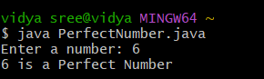

# java-lab-cse-g-5ef-add4
ADDITIONAL EXPEIMENT-4
## Additional Experimebt - 4 
# to check if the number is perfect number or not 
source code 
java 
```
  
import java.util.Scanner;

class PerfectNumber {
    public static void main(String[] args) {
        int num, sum = 0;

        Scanner sc = new Scanner(System.in);
        System.out.print("Enter a number: ");
        num = sc.nextInt();

        for (int i = 1; i <= num / 2; i++) {
            if (num % i == 0) {
                sum = sum + i;
            }
        }

        if (sum == num && num != 0) {
            System.out.println(num + " is a Perfect Number");
        } else {
            System.out.println(num + " is NOT a Perfect Number");
        }
    }
}

```
# output: 

